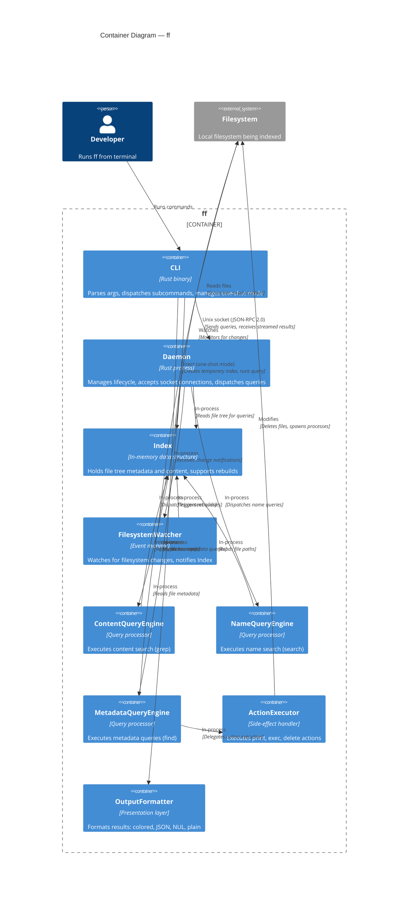

# Logical Containers

## Container Inventory

### 1. CLI

**Logical Type:** Client application

**Responsibility:** Parse user input, dispatch to the appropriate subcommand, communicate with the daemon or manage one-shot index lifecycle, and format output.

**Inputs / Outputs:**
- **Inputs:** Command-line arguments (subcommand, flags, patterns, paths)
- **Outputs:** Formatted results to stdout/stderr, exit codes

**Depends on:** Daemon (via socket), Index (in one-shot mode), OutputFormatter

**Key behaviors:**
- Detects missing daemon and triggers auto-start
- Parses subcommand-specific flags into query parameters
- Manages one-shot mode: creates temporary Index, runs query, exits
- Delegates result formatting to OutputFormatter

---

### 2. Daemon

**Logical Type:** Background service

**Responsibility:** Manage daemon lifecycle (auto-start, idle timeout, systemd integration), accept socket connections, dispatch queries to the appropriate query engine, and stream results back to the CLI.

**Inputs / Outputs:**
- **Inputs:** Socket connections from CLI, lifecycle signals (systemd, idle timer)
- **Outputs:** Streamed query results to CLI, lifecycle events

**Depends on:** Index, ContentQueryEngine, NameQueryEngine, MetadataQueryEngine, FilesystemWatcher

**Key behaviors:**
- Listens on Unix socket at `/tmp/fffd/<sha256(root)>.sock`
- Manages PID file for crash detection
- Tracks last query timestamp for idle timeout
- Spawns query engine per request, streams results back
- Coordinates index rebuilds (blocks queries during rebuild)

---

### 3. Index

**Logical Type:** Data store

**Responsibility:** Maintain an in-memory representation of the file tree, including file metadata and optionally file content. Support full rebuilds and provide query access to the file tree.

**Inputs / Outputs:**
- **Inputs:** Root path to scan, filesystem events (from FilesystemWatcher), rebuild commands
- **Outputs:** File metadata and content to query engines

**Depends on:** FilesystemWatcher (for change notifications)

**Key behaviors:**
- Scans entire file tree on startup, collecting stat metadata
- Optionally indexes file content (configurable budget)
- Rebuilds entire index on filesystem change (full rebuild strategy)
- Blocks queries during rebuild
- Provides file entries to query engines for evaluation

**Data model:**
- Path (String)
- Size (u64)
- Mtime, Atime, Ctime (i64)
- Mode (u32, permission bits)
- UID, GID (u32)
- Inode, Device (u64)
- Link count (u64)
- File type (u8: file/dir/symlink/socket/...)
- Content (optional, cached bytes)
- Git status (u8)

---

### 4. FilesystemWatcher

**Logical Type:** Event source

**Responsibility:** Monitor the indexed file tree for filesystem changes (create, modify, delete, rename) and notify the Index to trigger rebuilds.

**Inputs / Outputs:**
- **Inputs:** Root path to watch
- **Outputs:** Filesystem change events to Index

**Depends on:** none (operates independently)

**Key behaviors:**
- Uses platform-specific filesystem notification API (inotify on Linux, FSEvents on macOS)
- Coalesces rapid changes (debouncing) to avoid excessive rebuilds
- Notifies Index when changes are detected
- Handles recursive directory watching

---

### 5. ContentQueryEngine

**Logical Type:** Query processor

**Responsibility:** Execute content search queries against the Index. Parse regex patterns, apply case sensitivity rules, filter files, and return matching lines with context.

**Inputs / Outputs:**
- **Inputs:** Query parameters (pattern, case mode, context lines, file filters), Index reference
- **Outputs:** Stream of matching lines (path, line number, column, content, match ranges)

**Depends on:** Index

**Key behaviors:**
- Compiles regex pattern with appropriate case flags
- Iterates over Index entries, filtering by file type/extension/glob
- For each file, retrieves content from Index
- Applies regex to content, extracts match ranges
- Returns matching lines with before/after context
- Supports smart case, forced case-sensitive, forced case-insensitive

---

### 6. NameQueryEngine

**Logical Type:** Query processor

**Responsibility:** Execute name search queries against the Index. Match file paths/names against regex, glob, or fixed-string patterns. Apply filters (extension, type, depth, exclude).

**Inputs / Outputs:**
- **Inputs:** Query parameters (pattern, pattern mode, filters, depth constraints), Index reference
- **Outputs:** Stream of matching file paths

**Depends on:** Index

**Key behaviors:**
- Parses pattern as regex, glob, or fixed string
- Iterates over Index entries
- Applies pattern match to file name/path
- Filters by extension, type, depth, exclude patterns
- Returns matching paths

---

### 7. MetadataQueryEngine

**Logical Type:** Query processor

**Responsibility:** Execute metadata queries against the Index. Parse find-style boolean expressions, evaluate predicates against file metadata, and return matching paths.

**Inputs / Outputs:**
- **Inputs:** Query parameters (expression string, depth constraints), Index reference
- **Outputs:** Stream of matching file paths

**Depends on:** Index, ActionExecutor

**Key behaviors:**
- Parses find-style expression syntax into predicate tree
- Predicate types: name, path, type, size, mtime/atime/ctime, perm, user, group, inode, links, empty, newer, samefile
- Combinators: AND (implicit), OR (-o), NOT (!), parenthetical grouping
- Iterates over Index entries, evaluates predicate tree per file
- Returns matching paths
- Delegates action execution to ActionExecutor

---

### 8. ActionExecutor

**Logical Type:** Side-effect handler

**Responsibility:** Execute actions triggered by metadata query results. Handle print, exec, delete, printf, and ls actions.

**Inputs / Outputs:**
- **Inputs:** Action specification, list of matching paths
- **Outputs:** Side effects (printed output, spawned processes, deleted files)

**Depends on:** none (operates on filesystem directly)

**Key behaviors:**
- Print: output paths to stdout (with format variants: plain, -print0, -printf, -ls)
- Exec: spawn subprocess per match (-exec {} ;) or batch (-exec {} +)
- Execdir: spawn subprocess in file's directory
- Delete: unlink files or recursively delete directories
- Ok/okdir: prompt user for confirmation before exec

---

### 9. OutputFormatter

**Logical Type:** Presentation layer

**Responsibility:** Format query results for output. Handle colored terminal output, plain output for pipes, JSON output, NUL-delimited output, count output, and files-with-matches output.

**Inputs / Outputs:**
- **Inputs:** Query results (items, metadata), output format specification
- **Outputs:** Formatted text to stdout

**Depends on:** none (pure transformation)

**Key behaviors:**
- Detects if stdout is a terminal (TTY) or pipe
- Applies ANSI color codes for terminal output (match highlighting, path coloring)
- Strips colors for pipe output
- Formats results as JSON when requested
- Uses NUL delimiter when requested
- Aggregates counts when requested
- Lists files-with-matches when requested

---

## Container Diagram

## Communication Patterns

1. **CLI ↔ Daemon:** Synchronous request with streaming response over Unix socket (JSON-RPC 2.0). CLI sends query, daemon streams results back incrementally.

2. **Daemon ↔ Index:** In-process function calls. Daemon calls Index.query() and iterates over results.

3. **Daemon ↔ Query Engines:** In-process function calls. Daemon instantiates appropriate engine, passes Index reference and query parameters, streams results.

4. **Query Engines ↔ Index:** In-process reads. Engines call Index.getEntries() or Index.getContent(path) to access file data.

5. **FilesystemWatcher → Index:** In-process event notification. Watcher calls Index.triggerRebuild() when changes are detected.

6. **MetadataQueryEngine → ActionExecutor:** In-process delegation. Engine passes matching paths and action specification to executor.

7. **CLI → OutputFormatter:** In-process transformation. CLI passes query results to formatter, which returns formatted text.

8. **Index ↔ Filesystem:** Direct I/O. Index reads files and metadata via standard filesystem APIs.

9. **FilesystemWatcher ↔ Filesystem:** Platform-specific notification APIs (inotify, FSEvents).

10. **ActionExecutor ↔ Filesystem:** Direct I/O for deletions, subprocess spawning for exec.
