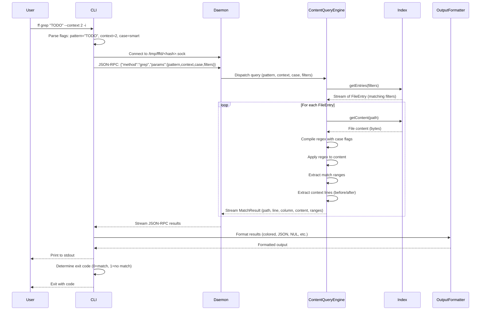

# Flow: Content Search

**Maps to PRD capabilities:** C-01 (Regex content search), C-02 (Case sensitivity), C-03 (Context lines), C-04 (File filtering), C-05 (Hidden file control), C-06 (Output format variants)

## Sequence Diagram

## Key Steps

1. **CLI parses flags:** Extracts pattern, case mode, context lines, file filters (glob, extension, type, hidden, ignore).

2. **CLI connects to daemon:** Determines socket path from current working directory, connects via Unix socket.

3. **CLI sends query:** JSON-RPC 2.0 request with method "grep" and parameters (pattern, case mode, context, filters).

4. **Daemon dispatches to ContentQueryEngine:** Daemon instantiates engine with Index reference and query parameters.

5. **ContentQueryEngine retrieves entries:** Engine calls Index.getEntries() with file filters. Index streams matching FileEntry objects (filtered by type, extension, glob, hidden, ignore).

6. **ContentQueryEngine processes each file:**
   - Retrieves file content from Index (cached bytes)
   - Compiles regex with appropriate case flags (smart case: lowercase pattern → case-insensitive, uppercase → case-sensitive)
   - Applies regex to content, extracts match ranges (start, end positions)
   - Extracts context lines (N lines before and after each match)
   - Streams MatchResult back to Daemon

7. **Daemon streams results to CLI:** Daemon forwards MatchResult objects as JSON-RPC notifications.

8. **CLI formats output:** CLI passes results to OutputFormatter, which applies formatting (colored, JSON, NUL-delimited, count, files-with-matches).

9. **CLI determines exit code:** If any matches found, exit 0. If no matches, exit 1. If error, exit 2.

## Error Paths

- **Daemon not running:** CLI detects connection refused, triggers auto-start, retries.
- **Index rebuilding:** Daemon returns "index rebuilding" status, CLI waits or returns error.
- **Regex compilation error:** ContentEngine returns error, CLI prints error message, exits 2.
- **Permission denied (unreadable file):** ContentEngine skips file, logs warning, continues.
- **Query timeout:** CLI cancels query after 30s, returns error, exits 2.
