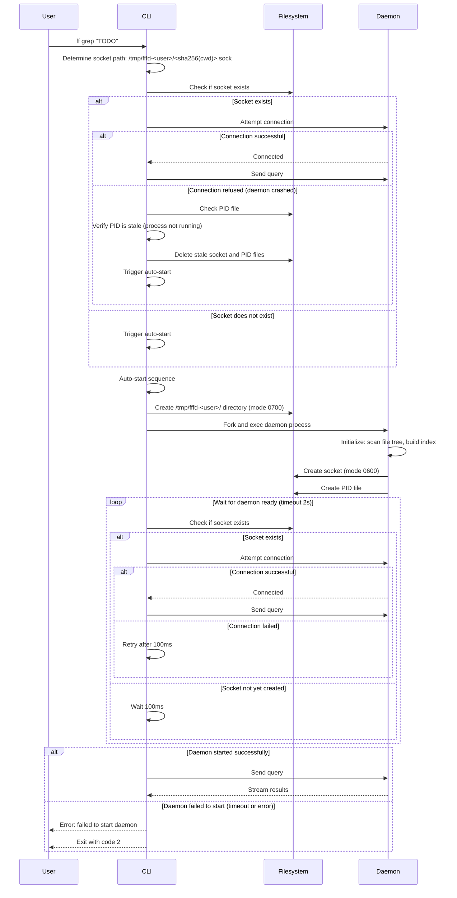

# Flow: Daemon Auto-Start

**Maps to PRD capabilities:** D-04 (Auto-start), I-05 (Daemon auto-start from CLI)

## Sequence Diagram

## Key Steps

1. **CLI determines socket path:** Computes socket path from username and current working directory: `/tmp/fffd-<username>/<sha256(cwd)>.sock`.

2. **CLI checks if socket exists:** If socket file exists, CLI attempts to connect.

3. **CLI handles connection failure:**
   - If connection refused, daemon may have crashed
   - CLI checks PID file to verify daemon is not running
   - CLI deletes stale socket and PID files
   - CLI triggers auto-start

4. **CLI triggers auto-start:**
   - Creates socket directory `/tmp/fffd-<username>/` with mode 0700 (if not exists)
   - Forks and execs daemon process with root path = current working directory
   - Daemon runs in background (detached from CLI)

5. **Daemon initializes:**
   - Scans entire file tree, builds index (~10s for 1M files)
   - Creates socket at `/tmp/fffd-<username>/<sha256(cwd)>.sock` with mode 0600
   - Creates PID file at `/tmp/fffd-<username>/<sha256(cwd)>.pid`
   - Starts filesystem watcher
   - Starts idle timeout timer

6. **CLI waits for daemon ready:** CLI polls socket existence and attempts connection every 100ms, up to 2s timeout.

7. **CLI sends query:** Once connected, CLI sends original query to daemon.

## Error Paths

- **Socket directory creation failed:** CLI returns error (permission denied, disk full), exits 2.
- **Daemon fork/exec failed:** CLI returns error (out of memory, binary not found), exits 2.
- **Daemon startup timeout:** CLI waits 2s for socket to appear. If timeout, CLI returns error, exits 2.
- **Daemon crashed during startup:** CLI detects connection refused, returns error, exits 2.

## Security Considerations

- Socket directory is created with mode 0700 (owner only)
- Socket file is created with mode 0600 (owner read/write only)
- Daemon verifies peer credentials on connection (SO_PEERCRED on Linux)
- PID file prevents multiple daemons for same root
