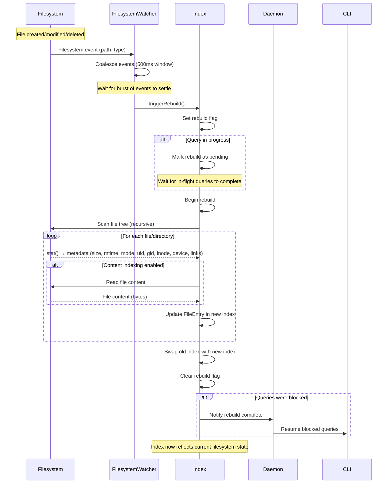

# Flow: Index Rebuild

**Maps to PRD capabilities:** D-02 (Full tree scan on startup), D-03 (Filesystem watching)

## Sequence Diagram

## Key Steps

1. **FilesystemWatcher detects change:** Platform-specific API (inotify on Linux, FSEvents on macOS) notifies watcher of filesystem event (create, modify, delete, rename).

2. **Watcher coalesces events:** Watcher waits 500ms for burst of events to settle. If multiple events arrive within 2s, they're batched into a single rebuild trigger.

3. **Watcher triggers rebuild:** Watcher calls Index.triggerRebuild(). Index sets rebuild flag.

4. **Index handles in-flight queries:**
   - If queries are in progress, rebuild is marked as pending
   - In-flight queries complete against current index (results may be stale)
   - New queries block until rebuild completes

5. **Index begins rebuild:**
   - Creates new empty index
   - Scans entire file tree recursively
   - For each file/directory:
     - Calls stat() to collect metadata (size, mtime, atime, ctime, mode, uid, gid, inode, device, link count, file type)
     - If content indexing is enabled, reads file content
     - Creates FileEntry and adds to new index
   - Respects ignore files (.gitignore, .ignore) and hidden file settings

6. **Index swaps indexes:**
   - Atomically replaces old index with new index
   - Clears rebuild flag
   - Notifies Daemon that rebuild is complete

7. **Daemon resumes blocked queries:**
   - Daemon unblocks queries that were waiting for rebuild
   - Queries now execute against fresh index

## Performance Characteristics

- **Scan time:** ~10s for 1M files on SSD
- **I/O pattern:** Sequential reads (stat + content), benefits from OS readahead
- **CPU usage:** Moderate (regex compilation for ignore patterns, content hashing)
- **Memory usage:** New index built in parallel with old index; peak memory = 2× index size during swap

## Error Paths

- **Permission denied (unreadable file):** Index skips file content, logs warning, continues with metadata-only entry.
- **File deleted during scan:** Index catches ENOENT, skips file, continues.
- **Disk I/O error:** Index logs error, continues with remaining files.
- **Out of memory:** Index fails rebuild, retains old index, logs error.

## Trade-offs

- **Full rebuild vs. incremental:** Full rebuild is simpler but slower for frequent small changes. Incremental updates are complex (handle renames, moves, hard links, race conditions).
- **Blocking queries vs. stale results:** Blocking ensures consistency but causes delays. Returning stale results is faster but may confuse users.
- **Parallel index build:** Building new index in parallel with old index doubles memory usage during rebuild but allows atomic swap.
