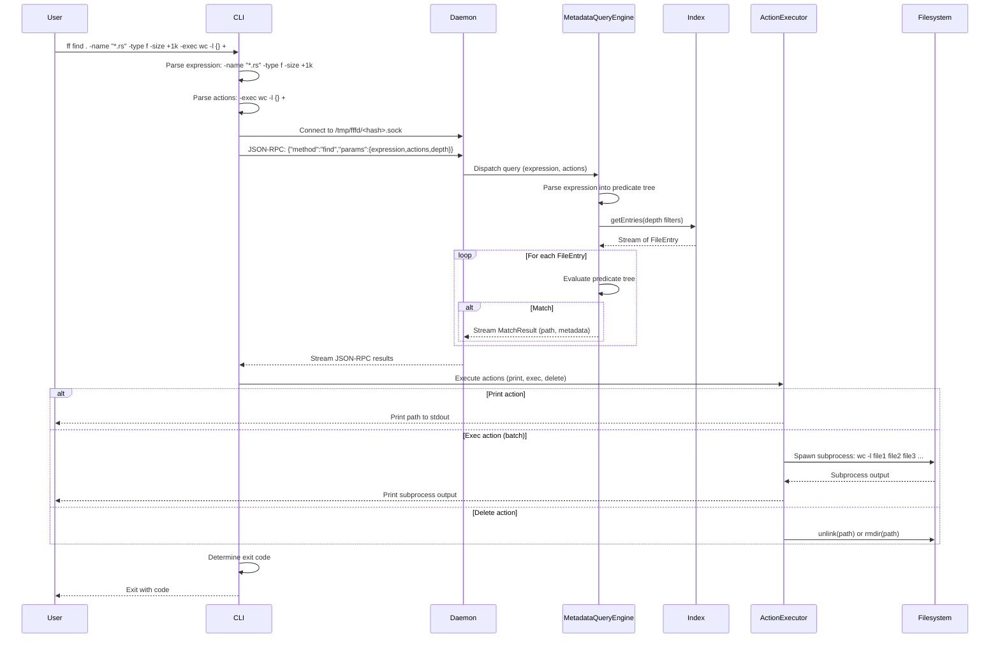

# Flow: Metadata Query

**Maps to PRD capabilities:** M-01 (Name predicate), M-02 (Type predicate), M-03 (Size predicate), M-04 (Time predicates), M-05 (Boolean expression parser), M-06 (Print action), M-07 (Exec action), M-08 (Delete action), M-09 (Depth control)

## Sequence Diagram

## Key Steps

1. **CLI parses expression:** Extracts predicates (-name, -type, -size, -mtime, -perm, etc.) and combines them into a boolean expression tree (AND/OR/NOT with parenthetical grouping).

2. **CLI parses actions:** Extracts actions (-print, -exec, -delete, -printf, -ls, etc.).

3. **CLI connects to daemon:** Same as content search flow.

4. **CLI sends query:** JSON-RPC 2.0 request with method "find" and parameters (expression, actions, depth constraints).

5. **Daemon dispatches to MetadataQueryEngine:** Daemon instantiates engine with Index reference and query parameters.

6. **MetadataQueryEngine parses expression:** Engine parses find-style expression syntax into a predicate tree:
   - Predicates: name, path, type, size, mtime/atime/ctime, perm, user, group, inode, links, empty, newer, samefile
   - Combinators: AND (implicit), OR (-o), NOT (!), parenthetical grouping

7. **MetadataQueryEngine retrieves entries:** Engine calls Index.getEntries() with depth constraints (minDepth, maxDepth). Index streams matching FileEntry objects.

8. **MetadataQueryEngine evaluates each file:**
   - Evaluates predicate tree against FileEntry metadata
   - Predicate evaluation:
     - Name: glob match against file name
     - Path: glob match against full path
     - Type: check file type (file, directory, symlink, socket, block, character, pipe)
     - Size: compare file size with threshold (with +/- prefix and unit suffix)
     - Mtime/Atime/Ctime: compare timestamp with threshold (days/minutes)
     - Perm: check permission bits (exact, any, all modes)
     - User/Group: check uid/gid or user/group name
     - Inode: check inode number
     - Links: check hard link count
     - Empty: check if file is empty (size 0) or directory is empty
     - Newer: compare mtime/atime/ctime with reference file
     - Samefile: check if same device and inode as reference path
   - If predicate tree evaluates to true, streams MatchResult (path, metadata) back to Daemon

9. **Daemon streams results to CLI:** Daemon forwards MatchResult objects as JSON-RPC notifications.

10. **CLI executes actions:** CLI passes results to ActionExecutor:
    - Print: outputs path to stdout (with format variants: -print, -print0, -printf, -ls)
    - Exec: spawns subprocess with matched paths substituted
      - `-exec cmd {} ;`: one subprocess per match
      - `-exec cmd {} +`: one subprocess with all matches as arguments
      - `-execdir cmd {} ;`: subprocess runs in file's directory
    - Delete: unlinks files or recursively deletes directories
    - Ok/okdir: prompts user for confirmation before exec

11. **CLI determines exit code:** If any matches found, exit 0. If no matches, exit 1. If error, exit 2.

## Error Paths

- **Expression parse error:** MetadataEngine returns error (e.g., unmatched parenthesis), CLI prints error, exits 2.
- **Action execution error:** ActionExecutor returns error (e.g., permission denied on delete), CLI prints error, continues with remaining matches.
- **Daemon not running:** Same as content search flow.
- **Index rebuilding:** Same as content search flow.
- **Query timeout:** Same as content search flow.

## Special Cases

- **Default action:** If no action is specified, default to `-print`.
- **Prune:** If `-prune` predicate matches, skip descending into directory.
- **Mount/xdev:** If `-mount` or `-xdev` flag is set, skip files on different filesystem (check device number).
- **Symlink following:** If `-L` or `-follow` flag is set, follow symbolic links (stat the target, not the link).
