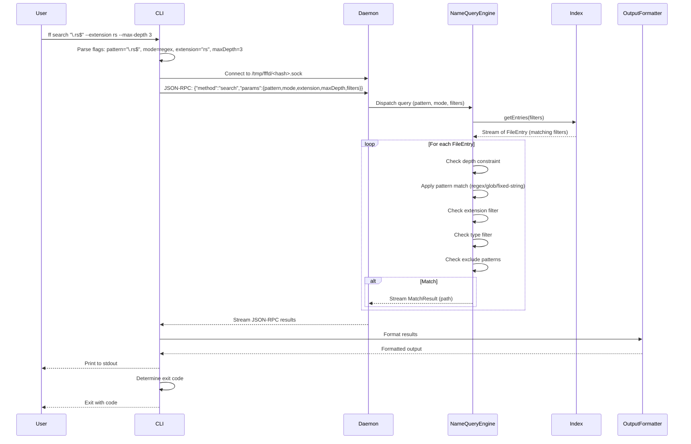

# Flow: Name Search

**Maps to PRD capabilities:** N-01 (Regex name search), N-02 (Glob name search), N-03 (Fixed-string name search), N-04 (Extension filter), N-05 (File type filter), N-06 (Depth control), N-07 (Exclude patterns), N-08 (Hidden and ignored file control)

## Sequence Diagram

## Key Steps

1. **CLI parses flags:** Extracts pattern, pattern mode (regex/glob/fixed-string), extension filter, type filter, depth constraints, exclude patterns, hidden/ignore flags.

2. **CLI connects to daemon:** Same as content search flow.

3. **CLI sends query:** JSON-RPC 2.0 request with method "search" and parameters.

4. **Daemon dispatches to NameQueryEngine:** Daemon instantiates engine with Index reference and query parameters.

5. **NameQueryEngine retrieves entries:** Engine calls Index.getEntries() with file filters (hidden, ignore). Index streams matching FileEntry objects.

6. **NameQueryEngine processes each file:**
   - Checks depth constraint (minDepth, maxDepth)
   - Applies pattern match to file name/path:
     - Regex: compiles regex, matches against file name
     - Glob: compiles glob pattern, matches against file name
     - Fixed-string: substring match against file name
   - Checks extension filter (if specified, file must have matching extension)
   - Checks type filter (file, directory, symlink, socket, executable, empty)
   - Checks exclude patterns (if path matches any exclude glob, skip)
   - If all checks pass, streams MatchResult (path) back to Daemon

7. **Daemon streams results to CLI:** Daemon forwards MatchResult objects as JSON-RPC notifications.

8. **CLI formats output:** CLI passes results to OutputFormatter.

9. **CLI determines exit code:** Same as content search flow.

## Error Paths

- **Invalid pattern:** NameEngine returns error (e.g., malformed regex), CLI prints error, exits 2.
- **Daemon not running:** Same as content search flow.
- **Index rebuilding:** Same as content search flow.
- **Query timeout:** Same as content search flow.
