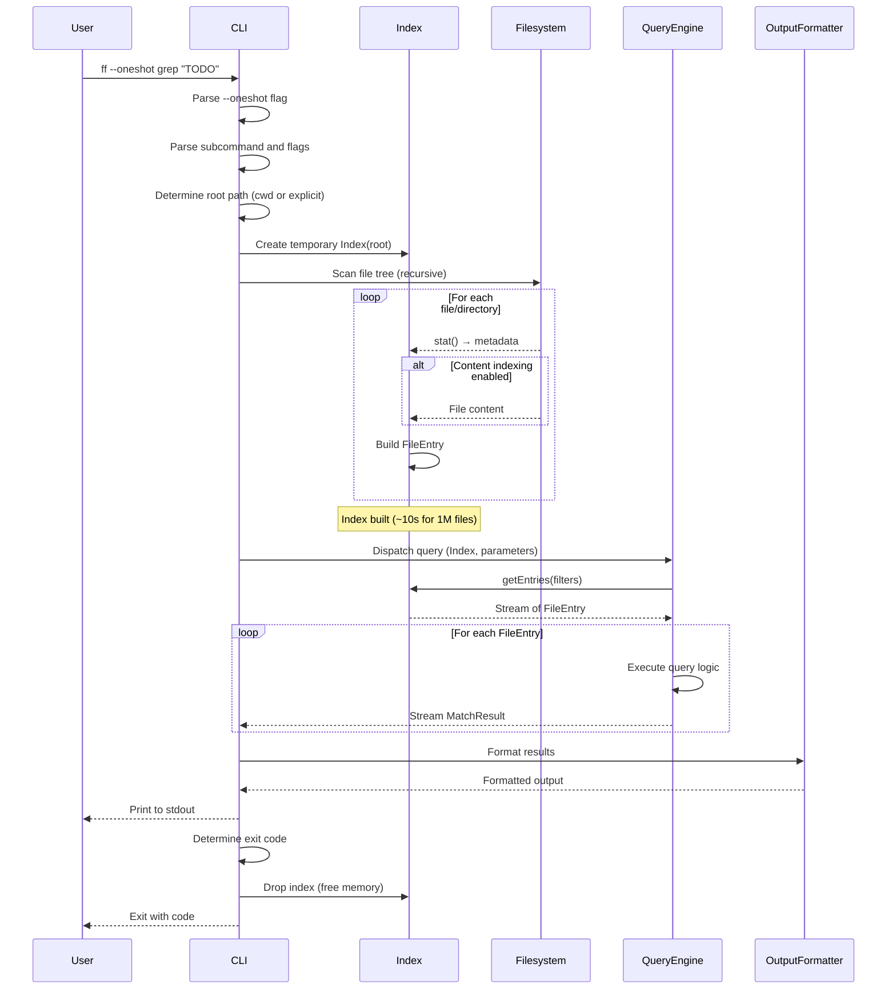

# Flow: One-Shot Mode

**Maps to PRD capabilities:** I-03 (One-shot mode)

## Sequence Diagram

## Key Steps

1. **CLI parses --oneshot flag:** CLI detects --oneshot flag and enters one-shot mode.

2. **CLI parses subcommand and flags:** Same as daemon mode (parse grep/search/find subcommand and flags).

3. **CLI creates temporary Index:**
   - Determines root path (current working directory or explicit path)
   - Creates Index instance with root path
   - Index is not managed by a daemon; lifecycle is tied to CLI process

4. **Index scans file tree:**
   - Recursively scans file tree
   - For each file/directory:
     - Calls stat() to collect metadata
     - If content indexing is enabled, reads file content
     - Creates FileEntry and adds to index
   - Respects ignore files and hidden file settings

5. **CLI dispatches query:** CLI instantiates appropriate query engine (Content, Name, or Metadata) with Index reference and query parameters.

6. **Query engine executes:** Same as daemon mode (engine iterates over Index entries, evaluates predicates/matches, streams results).

7. **CLI formats output:** Same as daemon mode (CLI passes results to OutputFormatter).

8. **CLI determines exit code:** Same as daemon mode (0=match, 1=no match, 2=error).

9. **CLI drops index:** CLI drops Index instance, freeing memory.

10. **CLI exits:** CLI exits with appropriate exit code.

## Use Cases

- **CI/CD pipelines:** Scripts that run once and exit
- **Cron jobs:** Periodic searches without persistent daemon
- **Memory-constrained environments:** Systems where persistent daemon is impractical
- **One-time searches:** User doesn't want to start a daemon for a single query

## Trade-offs

- **Index build cost:** One-shot mode pays the full index build cost (~10s for 1M files) on every invocation. This negates the speed advantage for repeated queries.
- **No filesystem watching:** One-shot mode doesn't watch for changes. Index is built once and used for a single query.
- **No idle timeout:** One-shot mode exits immediately after query completes. No persistent process.

## Error Paths

- **Permission denied (unreadable root):** CLI returns error, exits 2.
- **Index build failure (disk I/O error):** CLI logs error, exits 2.
- **Query error:** Same as daemon mode.

## Performance Characteristics

- **Index build time:** ~10s for 1M files on SSD
- **Query time:** Same as daemon mode (<250ms for hot queries)
- **Total time:** Index build + query = ~10s + <250ms ≈ ~10s

## Comparison to Daemon Mode

| Aspect | Daemon Mode | One-Shot Mode |
|--------|-------------|---------------|
| Index build | Once on daemon startup | Every invocation |
| Query latency | <250ms (hot) | <250ms (after build) |
| Total latency (first query) | ~10s (build) + <250ms | ~10s (build) + <250ms |
| Total latency (subsequent queries) | <250ms | ~10s (rebuild) + <250ms |
| Memory usage | Persistent (140–500MB) | Temporary (freed on exit) |
| Filesystem watching | Yes | No |
| Idle timeout | Yes | N/A (exits immediately) |
| Use case | Interactive development | Scripts, CI, one-time searches |
