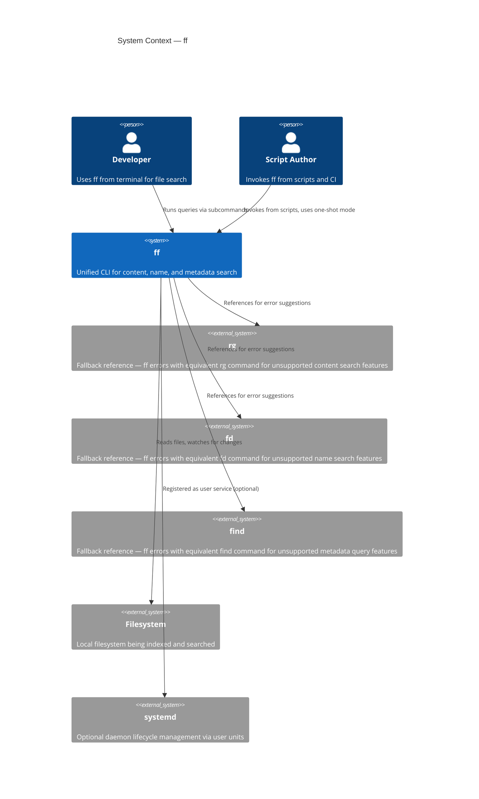
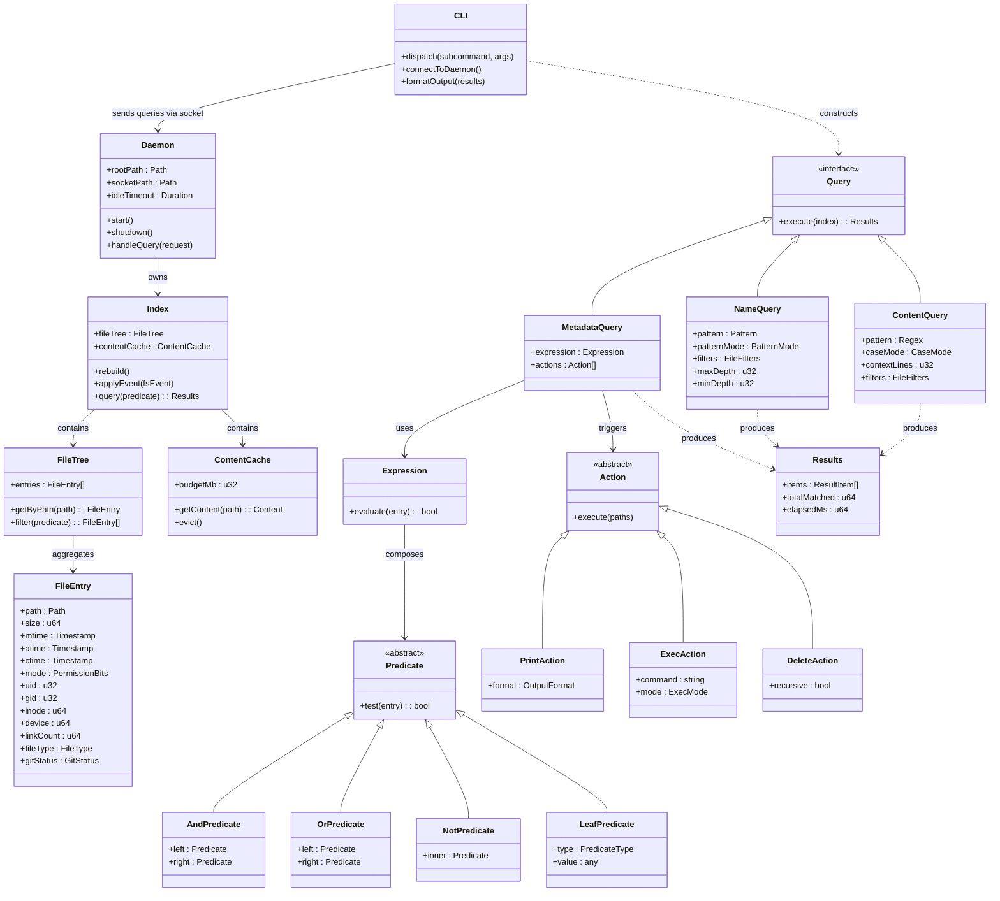

# Domain Model

## Context Diagram

```mermaid
C4Context
    title System Context — ff

    Person(dev, "Developer", "Uses ff from terminal for file search")
    Person(scripter, "Script Author", "Invokes ff from scripts and CI")

    System(ff, "ff", "Unified CLI for content, name, and metadata search")

    System_Ext(rg, "rg", "Fallback reference — ff errors with equivalent rg command for unsupported content search features")
    System_Ext(fd, "fd", "Fallback reference — ff errors with equivalent fd command for unsupported name search features")
    System_Ext(find, "find", "Fallback reference — ff errors with equivalent find command for unsupported metadata query features")
    System_Ext(fs, "Filesystem", "Local filesystem being indexed and searched")
    System_Ext(systemd, "systemd", "Optional daemon lifecycle management via user units")

    Rel(dev, ff, "Runs queries via subcommands")
    Rel(scripter, ff, "Invokes from scripts, uses one-shot mode")
    Rel(ff, fs, "Reads files, watches for changes")
    Rel(ff, systemd, "Registered as user service (optional)")
    Rel(ff, rg, "References for error suggestions")
    Rel(ff, fd, "References for error suggestions")
    Rel(ff, find, "References for error suggestions")
```

## Domain Concepts

```mermaid
classDiagram
    class CLI {
        +dispatch(subcommand, args)
        +connectToDaemon()
        +formatOutput(results)
    }

    class Daemon {
        +rootPath : Path
        +socketPath : Path
        +idleTimeout : Duration
        +start()
        +shutdown()
        +handleQuery(request)
    }

    class Index {
        +fileTree : FileTree
        +contentCache : ContentCache
        +rebuild()
        +applyEvent(fsEvent)
        +query(predicate) : Results
    }

    class FileTree {
        +entries : FileEntry[]
        +getByPath(path) : FileEntry
        +filter(predicate) : FileEntry[]
    }

    class FileEntry {
        +path : Path
        +size : u64
        +mtime : Timestamp
        +atime : Timestamp
        +ctime : Timestamp
        +mode : PermissionBits
        +uid : u32
        +gid : u32
        +inode : u64
        +device : u64
        +linkCount : u64
        +fileType : FileType
        +gitStatus : GitStatus
    }

    class ContentCache {
        +budgetMb : u32
        +getContent(path) : Content
        +evict()
    }

    class Query {
        <<interface>>
        +execute(index) : Results
    }

    class ContentQuery {
        +pattern : Regex
        +caseMode : CaseMode
        +contextLines : u32
        +filters : FileFilters
    }

    class NameQuery {
        +pattern : Pattern
        +patternMode : PatternMode
        +filters : FileFilters
        +maxDepth : u32
        +minDepth : u32
    }

    class MetadataQuery {
        +expression : Expression
        +actions : Action[]
    }

    class Expression {
        +evaluate(entry) : bool
    }

    class Predicate {
        <<abstract>>
        +test(entry) : bool
    }

    class AndPredicate {
        +left : Predicate
        +right : Predicate
    }

    class OrPredicate {
        +left : Predicate
        +right : Predicate
    }

    class NotPredicate {
        +inner : Predicate
    }

    class LeafPredicate {
        +type : PredicateType
        +value : any
    }

    class Action {
        <<abstract>>
        +execute(paths)
    }

    class PrintAction {
        +format : OutputFormat
    }

    class ExecAction {
        +command : string
        +mode : ExecMode
    }

    class DeleteAction {
        +recursive : bool
    }

    class Results {
        +items : ResultItem[]
        +totalMatched : u64
        +elapsedMs : u64
    }

    CLI --> Daemon : sends queries via socket
    Daemon --> Index : owns
    Index --> FileTree : contains
    Index --> ContentCache : contains
    FileTree --> FileEntry : aggregates
    CLI ..> Query : constructs
    Query <|-- ContentQuery
    Query <|-- NameQuery
    Query <|-- MetadataQuery
    MetadataQuery --> Expression : uses
    Expression --> Predicate : composes
    Predicate <|-- AndPredicate
    Predicate <|-- OrPredicate
    Predicate <|-- NotPredicate
    Predicate <|-- LeafPredicate
    MetadataQuery --> Action : triggers
    Action <|-- PrintAction
    Action <|-- ExecAction
    Action <|-- DeleteAction
    ContentQuery ..> Results : produces
    NameQuery ..> Results : produces
    MetadataQuery ..> Results : produces
```
