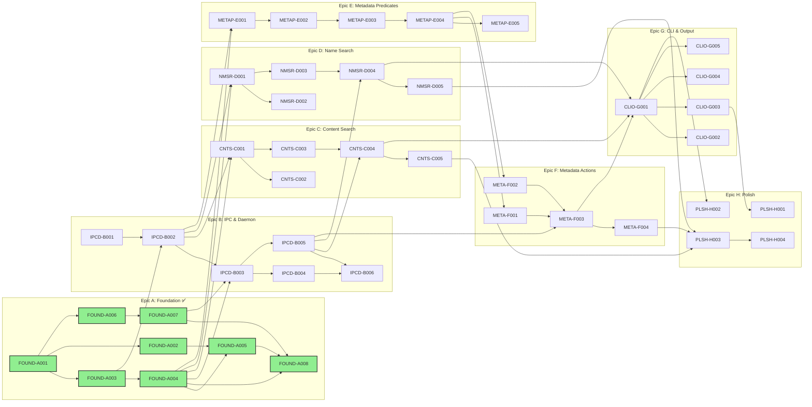

# Critical Path

**Version:** v0.1.0

## Active Backlog Summary

**Total Active Story Points:** 120  
**Total Active Tickets:** 34  
**Total Spikes:** 2  
**Total Epics:** 7

## Critical Path

The critical path runs through the metadata query chain, which has the deepest dependency chain:

1. **IPCD-B001** — Spike: JSON-RPC Streaming Protocol
2. **IPCD-B002** — ff-ipc: Protocol Types and Codec
3. **IPCD-B003** — ff-daemon: Lifecycle Management
4. **IPCD-B004** — ff-daemon: Socket Server
5. **METAP-E001** — Predicate Types and Evaluator
6. **METAP-E002** — Spike: Find Expression Parser
7. **METAP-E003** — Expression Parser
8. **METAP-E004** — Metadata Query Engine
9. **META-F001** — Action Executor
10. **META-F003** — find Subcommand
11. **CLIO-G001** — Main Dispatch and Daemon Client
12. **CLIO-G002** — One-Shot Mode
13. **PLSH-H003** — Comprehensive Compatibility Tests
14. **PLSH-H004** — Benchmark Suite and Release

**Critical path story points:** 84 of 120 total (70%)

## Build Order Diagram

## Phasing Strategy

### v0.1.0 Scope (Active)

All P0 and P1 capabilities from the PRD (72 capabilities). This includes:
- Full content search (grep) with rg flag compatibility
- Full name search (search) with fd flag compatibility
- Full metadata query (find) with predicate and action support
- Daemon with auto-start, idle timeout, and systemd integration
- One-shot mode for scripts and CI
- All output formats (colored, JSON, NUL, plain)
- Shell completions (bash, zsh, fish)
- Comprehensive compatibility test suite

### Deferred to v0.2.0

P2 capabilities:
- C-11: PCRE2 pattern support (lookaround assertions)
- M-22: Ok/prompt action (-ok, -okdir)

### Future Consideration

- Persist metadata-only index to disk for faster daemon startup
- Incremental index updates instead of full rebuilds
- Query result caching
- Query cancellation propagation
